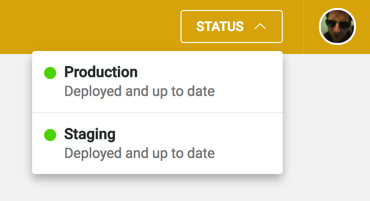
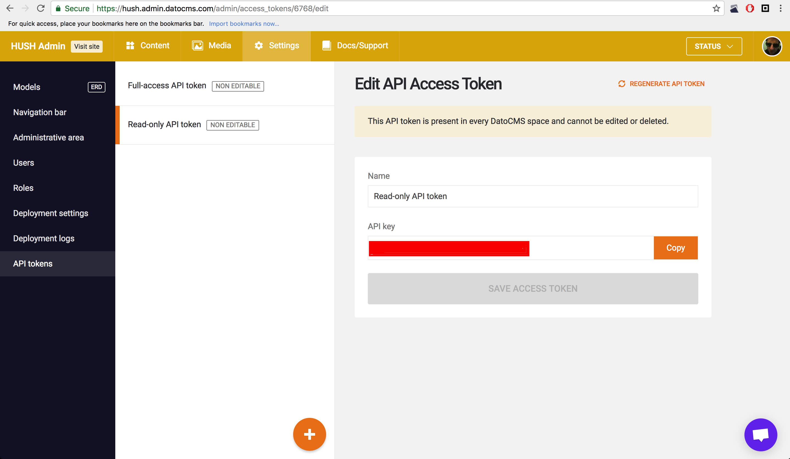

# HUSH WebSite Specification

## Description
1. A well designed visually appealing website that encourages conversions
2. Lightning fast load times
3. Well documented code and release notes to enable others to update the project in the future
if necessary.

## Technologies
1. Design (Mobile first) two artboard in the PSD format
2. Developnemt:
- HTML
- CSS (SASS preprocessor)
- JS
- Bundeling: WebPack, path: ./webpack.config.js
- SSG HUGO
3. CMS
- CMS: "DATO CMS"
> - Configs: main config file ./dato.config.js, income pages configs ./dato-config/
> - Docs: http://support.datocms.com/support/home

## Continius Deployment
1. Version control system "Git/GitHub"
2. Deployment system "Netlify"
> Current site have two envoirements, PRODUCTION & STAGE .
> - Porduction: hush.com Pass: dev
> - Stage: hush-stage.netlify.com Pass: stage

## Project setup:
### Development
1. git clole git@github.com:LumoSpark/clients-hush.git
2. cd clients-hush
3. npm install
4. export DATO_API_TOKEN=abc123
5. echo 'DATO_API_TOKEN=abc123' >> .env

*DATO_API_TOKEN: *

### Deployment
1. Deploymennt system: https://www.netlify.com/
2. Netlify configuration:

3. DATO API tocken same w/ Development, more details about DATO CMS deployment setup: https://docs.datocms.com/deployment/netlify.html

